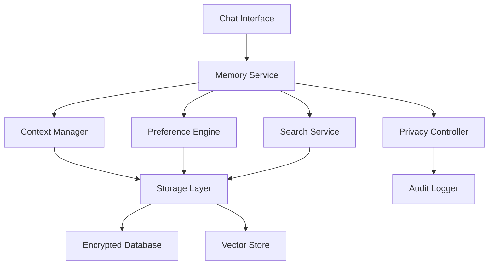

# Design Document

## Overview

The conversational memory system is designed as a modular service that integrates with the existing chat infrastructure to provide persistent conversation context and user preference learning. The system uses a layered architecture with clear separation between storage, processing, and retrieval components, ensuring scalability and maintainability while preserving user privacy.

## Architecture

The conversational memory system follows a microservice architecture pattern with the following key components:



### Core Components

1. **Memory Service**: Central orchestrator that handles all memory-related operations
2. **Context Manager**: Manages conversation context, summarization, and retrieval
3. **Preference Engine**: Learns and applies user preferences and communication styles
4. **Search Service**: Provides full-text and semantic search capabilities
5. **Privacy Controller**: Enforces data retention policies and user privacy preferences
6. **Storage Layer**: Abstraction over different storage backends

## Components and Interfaces

### Memory Service Interface

```typescript
interface MemoryService {
  // Core memory operations
  storeConversation(userId: string, conversation: Conversation): Promise<void>
  retrieveContext(userId: string, limit?: number): Promise<ConversationContext>
  searchHistory(userId: string, query: SearchQuery): Promise<SearchResult[]>
  
  // Privacy and control
  deleteUserData(userId: string, options?: DeleteOptions): Promise<void>
  exportUserData(userId: string): Promise<UserDataExport>
  updatePrivacySettings(userId: string, settings: PrivacySettings): Promise<void>
}
```

### Context Manager

```typescript
interface ContextManager {
  buildContext(userId: string, currentMessage: string): Promise<ConversationContext>
  summarizeConversation(conversation: Conversation): Promise<ConversationSummary>
  updateContext(userId: string, newExchange: MessageExchange): Promise<void>
  pruneOldContext(userId: string): Promise<void>
}
```

### Preference Engine

```typescript
interface PreferenceEngine {
  analyzeUserPreferences(userId: string, conversations: Conversation[]): Promise<UserPreferences>
  applyPreferences(userId: string, response: string): Promise<string>
  updatePreferences(userId: string, feedback: UserFeedback): Promise<void>
  getPreferences(userId: string): Promise<UserPreferences>
}
```

## Data Models

### Core Data Structures

```typescript
interface Conversation {
  id: string
  userId: string
  timestamp: Date
  messages: Message[]
  summary?: string
  tags: string[]
  metadata: ConversationMetadata
}

interface Message {
  id: string
  role: 'user' | 'assistant'
  content: string
  timestamp: Date
  metadata: MessageMetadata
}

interface ConversationContext {
  recentMessages: Message[]
  relevantHistory: ConversationSummary[]
  userPreferences: UserPreferences
  contextSummary: string
}

interface UserPreferences {
  responseStyle: ResponseStyle
  topicInterests: TopicInterest[]
  communicationPreferences: CommunicationPreferences
  lastUpdated: Date
}

interface SearchQuery {
  keywords?: string[]
  dateRange?: DateRange
  topics?: string[]
  limit?: number
  offset?: number
}
```

### Storage Schema

The system uses a hybrid storage approach:

1. **Relational Database** (PostgreSQL) for structured data:
   - User profiles and preferences
   - Conversation metadata
   - Privacy settings and audit logs

2. **Document Store** (MongoDB) for conversation content:
   - Full conversation transcripts
   - Message content and metadata
   - Conversation summaries

3. **Vector Database** (Pinecone/Weaviate) for semantic search:
   - Message embeddings
   - Topic vectors
   - Similarity search indices

## Error Handling

### Graceful Degradation Strategy

The system implements a multi-tier fallback approach:

1. **Primary Mode**: Full memory functionality with all features enabled
2. **Limited Mode**: Basic context retention without advanced features
3. **Fallback Mode**: Standard conversation mode without memory

### Error Recovery Patterns

```typescript
class MemoryServiceWithFallback implements MemoryService {
  async retrieveContext(userId: string): Promise<ConversationContext> {
    try {
      return await this.primaryMemoryService.retrieveContext(userId)
    } catch (error) {
      this.logger.warn('Primary memory service failed, using fallback', error)
      return await this.fallbackContextService.getBasicContext(userId)
    }
  }
}
```

### Data Corruption Handling

- Implement data validation at ingestion
- Use checksums for data integrity verification
- Isolate corrupted data segments
- Maintain backup indices for critical data

## Testing Strategy

### Unit Testing

- **Component Testing**: Test each service component in isolation
- **Data Model Testing**: Validate data structures and transformations
- **Privacy Logic Testing**: Ensure privacy controls work correctly
- **Error Handling Testing**: Verify graceful degradation scenarios

### Integration Testing

- **Storage Integration**: Test database operations and data consistency
- **Service Integration**: Verify component interactions
- **Privacy Compliance**: Test data deletion and export functionality
- **Performance Testing**: Validate response times and throughput

### End-to-End Testing

- **User Journey Testing**: Test complete conversation flows with memory
- **Privacy Workflow Testing**: Test user data control features
- **Search Functionality Testing**: Validate search accuracy and performance
- **Fallback Scenario Testing**: Ensure system resilience

### Security Testing

- **Data Encryption Testing**: Verify encryption at rest and in transit
- **Access Control Testing**: Validate user data isolation
- **Audit Trail Testing**: Ensure proper logging of data access
- **Privacy Compliance Testing**: Verify GDPR/CCPA compliance features

## Performance Considerations

### Caching Strategy

- **Context Cache**: Cache recent conversation context for active users
- **Preference Cache**: Cache user preferences for quick access
- **Search Index Cache**: Cache frequently accessed search results

### Optimization Techniques

- **Lazy Loading**: Load conversation history on demand
- **Batch Processing**: Process multiple conversations in batches
- **Async Operations**: Use asynchronous processing for non-critical operations
- **Connection Pooling**: Optimize database connection management

### Scalability Design

- **Horizontal Scaling**: Design services to scale across multiple instances
- **Data Partitioning**: Partition user data by user ID or date ranges
- **Load Balancing**: Distribute requests across service instances
- **Resource Monitoring**: Monitor and auto-scale based on usage patterns